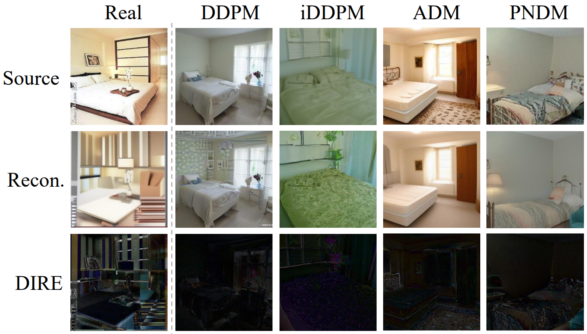
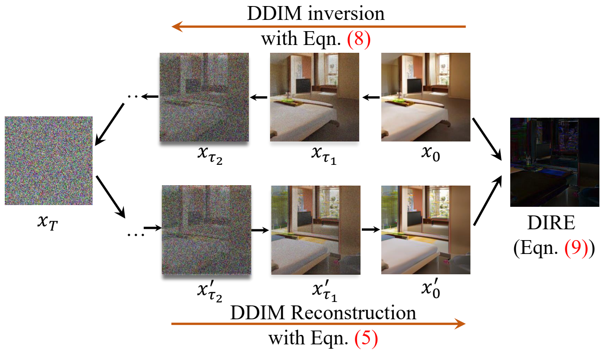

# DIRE for Diffusion-Generated Image Detection (ICCV 2023)
<b> <a href='https://zhendongwang6.github.io/'>Zhendong Wang</a>, <a href='https://jianminbao.github.io/'>Jianmin Bao</a>, <a href='http://staff.ustc.edu.cn/~zhwg/'>Wengang Zhou</a>, Weilun Wang, Hezhen Hu, Hong Chen, <a href='http://staff.ustc.edu.cn/~lihq/en/'>Houqiang Li </a> </b>

[[paper](https://arxiv.org/abs/2303.09295)] [[DiffusionForensics dataset]([BaiduDrive (password: dire)](https://pan.baidu.com/s/1Rdzc7l8P0RrJft0cW0a4Gg)] [[pre-trained model]([BaiduDrive (password: dire)](https://pan.baidu.com/s/1Rdzc7l8P0RrJft0cW0a4Gg)]

## News
- [2024/09/26] :fire: Fix up the link of our data, model. We provide them in [[BaiduDrive (password: dire)](https://pan.baidu.com/s/1Rdzc7l8P0RrJft0cW0a4Gg)] and [[RecDrive (password: dire)](https://rec.ustc.edu.cn/share/ec980150-4615-11ee-be0a-eb822f25e070)].
- [2023/08/27] :fire: Release code, dataset and pre-trained models. [[OneDrive](https://mailustceducn-my.sharepoint.com/:f:/g/personal/zhendongwang_mail_ustc_edu_cn/EtKXrn4cjWtBi0H3v4j1ICsBKraCxnZiTWU4VzqRr0ilCw?e=trkgDR)]/[[RecDrive (code: dire)](https://rec.ustc.edu.cn/share/ec980150-4615-11ee-be0a-eb822f25e070)]

- [2023/07/14] :tada: DIRE is accepted by ICCV 2023.
- [2023/03/16] :sparkles: Release [paper](https://arxiv.org/abs/2303.09295).
## Abstract
> Diffusion models have shown remarkable success in visual synthesis, but have also raised concerns about potential abuse for malicious purposes. In this paper, we seek to build a detector for telling apart real images from diffusion-generated images. We find that existing detectors struggle to detect images generated by diffusion models, even if we include generated images from a specific diffusion model in their training data. To address this issue, we propose a novel image representation called DIffusion Reconstruction Error (DIRE), which measures the error between an input image and its reconstruction counterpart by a pre-trained diffusion model. We observe that diffusion-generated images can be approximately reconstructed by a diffusion model while real images cannot. It provides a hint that DIRE can serve as a bridge to distinguish generated and real images. DIRE provides an effective way to detect images generated by most diffusion models, and it is general for detecting generated images from unseen diffusion models and robust to various perturbations. Furthermore, we establish a comprehensive diffusion-generated benchmark including images generated by eight diffusion models to evaluate the performance of diffusion-generated image detectors. Extensive experiments on our collected benchmark demonstrate that DIRE exhibits superiority over previous generated-image detectors.

<p align="center">

</p>

## DIRE pipeline
<p align="center">

</p>

## Requirements
```
conda create -n dire python=3.9
conda activate dire
pip install torch==2.0.0+cu117 torchvision==0.15.1+cu117 -f https://download.pytorch.org/whl/torch_stable.html
pip install -r requirements.txt
```
## DiffusionForensics Dataset
The DiffusionForensics dataset can be downloaded from [[BaiduDrive (password: dire)](https://pan.baidu.com/s/1Rdzc7l8P0RrJft0cW0a4Gg)] or [[RecDrive (password: dire)](https://rec.ustc.edu.cn/share/ec980150-4615-11ee-be0a-eb822f25e070)]. The dataset is organized as follows:
```
images/recons/dire
└── train/val/test
    ├── lsun_bedroom
    │   ├── real
    │   │   └──img1.png...
    │   ├── adm
    │   │   └──img1.png...
    │   ├── ...
    ├── imagenet
    │   ├── real
    │   │   └──img1.png...
    │   ├── adm
    │   │   └──img1.png...
    │   ├── ...
    └── celebahq
        ├── real
        │   └──img1.png...
        ├── adm
        │   └──img1.png...
        ├── ...

```
## Training
Before training, you should link the training real and DIRE images to the `data/train` folder. For example, you can link the DIRE images of real LSUN-Bedroom to `data/train/lsun_adm/0_real` and link the DIRE images of ADM-LSUN-Bedroom to `data/train/lsun_adm/1_fake`. And do the same for validation set and testing set, just modify `data/train` to `data/val` and `data/test`. Then, you can train the DIRE model by running the following command:
```
sh train.sh
```
## Evaluation
We provide the pre-trained DIRE model in [[BaiduDrive (password: dire)](https://pan.baidu.com/s/1Rdzc7l8P0RrJft0cW0a4Gg)] and [[RecDrive (password: dire)](https://rec.ustc.edu.cn/share/ec980150-4615-11ee-be0a-eb822f25e070)].
You can evaluate the DIRE model by running the following command:
```
sh test.sh
```
## Inference
We also provide a inference demo `demo.py`. You can run the following command to inference a single image or a folder of images:
```
python demo.py -f [image_path/image_dir] -m [model_path]
```

## Acknowledgments
Our code is developed based on [guided-diffusion](https://github.com/openai/guided-diffusion) and [CNNDetection](https://github.com/peterwang512/CNNDetection). Thanks for their sharing codes and models.

## Citation
If you find this work useful for your research, please cite our paper:
```
@article{wang2023dire,
  title={DIRE for Diffusion-Generated Image Detection},
  author={Wang, Zhendong and Bao, Jianmin and Zhou, Wengang and Wang, Weilun and Hu, Hezhen and Chen, Hong and Li, Houqiang},
  journal={arXiv preprint arXiv:2303.09295},
  year={2023}
}
```
